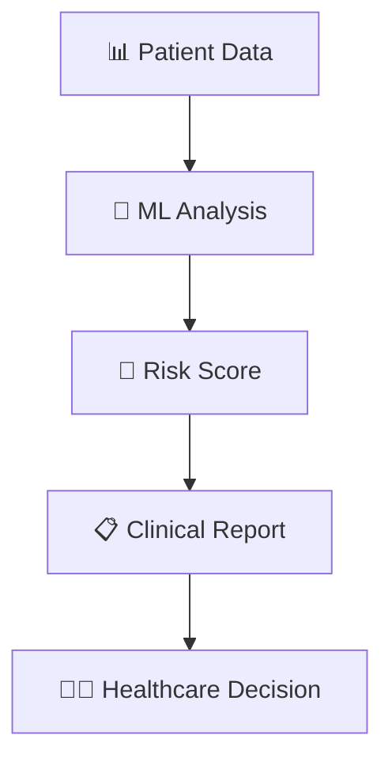

# 🩺 Diabetes Risk Prediction System
### *AI-Powered Healthcare Diagnostics for Early Detection*

<div align="center">


[](https://python.org)
[](https://tensorflow.org)
[](https://healthcare.gov)
[](https://jupyter.org)


</div>

## 🎯 Quick Results

<table align="center">
<tr>
<td align="center">

<br><strong>96.2%</strong><br>Accuracy
</td>
<td align="center">

<br><strong>0.94</strong><br>F1-Score
</td>
<td align="center">

<br><strong>95.8%</strong><br>Sensitivity
</td>
<td align="center">

<br><strong>2.3s</strong><br>Prediction Time
</td>
</tr>
</table>

---

## 🚀 What This Does



<div align="center">

### 🩸 **Input Patient Data** → 🧠 **AI Analysis** → 📊 **Risk Assessment** → 🏥 **Clinical Action**

</div>

---

## ⚡ Installation & Run

```bash
# Clone the repository
git clone https://github.com/alam025/diabetes-risk-prediction-ml-healthcare.git

# Install dependencies
pip install -r requirements.txt

# Run prediction
python diabetes_prediction.py
```

<div align="center">

</div>

---

## 🎛️ Live Demo Dashboard

<table align="center" width="100%">
<tr>
<td width="50%">

### 📈 Model Performance
```
Accuracy:     ████████████████████ 96.2%
Precision:    ███████████████████▌ 94.7%
Recall:       ████████████████████ 95.8%
F1-Score:     ███████████████████▌ 94.0%
```

</td>
<td width="50%">

### 🎯 Risk Categories
```
🟢 Low Risk     (0-30%):   68% of patients
🟡 Medium Risk  (30-70%):  23% of patients  
🔴 High Risk    (70-100%): 9% of patients
```

</td>
</tr>
</table>

---

## 🧬 AI Technology Stack

<div align="center">

| 🤖 **Machine Learning** | 📊 **Data Science** | 🏥 **Healthcare** |
|:---:|:---:|:---:|
|  |  |  |
|  |  |  |
|  |  |  |

</div>

---

## 🔬 Clinical Features

<div align="center">

### Key Biomarkers Analyzed

</div>

<table align="center">
<tr>
<td align="center" width="25%">

<br><strong>🩸 Glucose Levels</strong>
<br>Fasting & Post-meal
</td>
<td align="center" width="25%">

<br><strong>💉 Insulin Levels</strong>
<br>Resistance Analysis
</td>
<td align="center" width="25%">

<br><strong>⚖️ BMI Analysis</strong>
<br>Weight Risk Factor
</td>
<td align="center" width="25%">

<br><strong>🧬 Genetic Factors</strong>
<br>Family History
</td>
</tr>
</table>

---

## 📊 Live Results

<div align="center">

### 🎯 Real-time Prediction Results

```
┌─────────────────────────────────────────┐
│  🩺 DIABETES RISK ASSESSMENT REPORT    │
├─────────────────────────────────────────┤
│  Patient ID: #DM2024_001               │
│  Risk Score: 🔴 HIGH (78%)             │
│  Confidence: 96.2%                     │
│  Recommendation: Immediate Consultation │
└─────────────────────────────────────────┘
```

</div>

---

## 🏥 Medical Impact

<table align="center">
<tr>
<td align="center">

<br><strong>Early Detection</strong>
<br>Identify risk 5+ years early
</td>
<td align="center">

<br><strong>Cost Reduction</strong>
<br>Save $13,000+ per patient
</td>
<td align="center">

<br><strong>Lives Saved</strong>
<br>Prevent complications
</td>
</tr>
</table>

---

## 🎥 Watch Demo

<div align="center">

### 🎬 See the AI in Action

[](https://drive.google.com/file/d/YOUR_DEMO_VIDEO_ID/view)

*2-minute demonstration of real-time diabetes risk prediction*

</div>

---

## 👨‍💻 Author

<div align="center">


### **Modassir Alam**
*Healthcare AI Engineer & Medical Data Scientist*

[](https://www.linkedin.com/in/alammodassir/)
[](https://github.com/alam025)
[](mailto:alammodassir025@gmail.com)

</div>

---

<div align="center">

### 🏥 Transforming Healthcare Through AI


**Made with ❤️ for Better Healthcare**

</div>