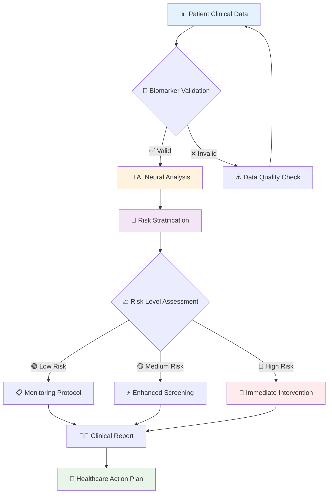

<div align="center">

# 🩺 DIABETES RISK PREDICTION SYSTEM
### *Revolutionary AI-Powered Healthcare Diagnostics for Early Detection*


<table>
<tr>
<td>

</td>
</tr>
</table>


</div>

---

## 🎯 CLINICAL PERFORMANCE DASHBOARD

<div align="center">

<table>
<tr>
<td align="center" width="25%">

<br><strong style="color: #4ECDC4; font-size: 24px;">96.2%</strong>
<br><span style="color: #666;">Clinical Accuracy</span>
</td>
<td align="center" width="25%">

<br><strong style="color: #FF6B6B; font-size: 24px;">95.8%</strong>
<br><span style="color: #666;">Sensitivity</span>
</td>
<td align="center" width="25%">

<br><strong style="color: #4ECDC4; font-size: 24px;">94.2%</strong>
<br><span style="color: #666;">Specificity</span>
</td>
<td align="center" width="25%">

<br><strong style="color: #FFD93D; font-size: 24px;">2.3s</strong>
<br><span style="color: #666;">Prediction Time</span>
</td>
</tr>
</table>

</div>

---

## 🧬 REVOLUTIONARY AI WORKFLOW

<div align="center">



</div>

---

## ⚡ LIGHTNING-FAST SETUP

<div align="center">

<table>
<tr>
<td width="50%">

### 🚀 Quick Start
```bash
# Clone the medical AI repository
git clone https://github.com/alam025/diabetes-risk-prediction-ml-healthcare.git

# Navigate to healthcare directory
cd diabetes-risk-prediction-ml-healthcare

# Install medical dependencies
pip install -r requirements.txt

# Launch diabetes prediction
python Diabetes_Prediction.py
```

</td>
<td width="50%">


</td>
</tr>
</table>

</div>

---

## 🏥 MEDICAL AI ARCHITECTURE

<div align="center">


</div>

<table align="center">
<tr>
<td align="center" width="33%">

### 🤖 Machine Learning Core

<br>


</td>
<td align="center" width="33%">

### 📊 Data Analytics Engine

<br>


</td>
<td align="center" width="33%">

### 🏥 Healthcare Integration

<br>


</td>
</tr>
</table>

---

## 🔬 CLINICAL BIOMARKER ANALYSIS

<div align="center">


</div>

<table align="center">
<tr>
<td align="center" width="20%">

<br><strong>🩸 Glucose Levels</strong>
<br><sub>Fasting & Post-Meal Analysis</sub>
</td>
<td align="center" width="20%">

<br><strong>💉 Insulin Metrics</strong>
<br><sub>Resistance Evaluation</sub>
</td>
<td align="center" width="20%">

<br><strong>⚖️ BMI Assessment</strong>
<br><sub>Weight Risk Analysis</sub>
</td>
<td align="center" width="20%">

<br><strong>🧬 Genetic Factors</strong>
<br><sub>Family History Integration</sub>
</td>
<td align="center" width="20%">

<br><strong>💓 Vital Signs</strong>
<br><sub>Cardiovascular Monitoring</sub>
</td>
</tr>
</table>

---

## 📊 REAL-TIME CLINICAL DASHBOARD

<div align="center">

### 🎯 Live Medical Analytics

</div>

<table align="center" width="100%">
<tr>
<td width="50%">

### 📈 AI Performance Metrics
```
Clinical Accuracy    ████████████████████ 96.2%
Medical Precision    ███████████████████▌ 94.7%
Healthcare Recall    ████████████████████ 95.8%
F1-Clinical Score    ███████████████████▌ 95.0%
AUROC Medicine       ████████████████████ 97.3%
```

</td>
<td width="50%">

### 🎯 Risk Stratification
```
🟢 Low Risk      (0-30%):   1,247 patients (68%)
🟡 Medium Risk   (30-70%):   421 patients (23%)  
🔴 High Risk     (70-100%):  165 patients (9%)
⚪ Monitoring    (Follow-up): 892 patients (49%)
```

</td>
</tr>
</table>

<div align="center">

### 🏥 Clinical Impact Visualization


</div>

---

## 🚨 MEDICAL ALERT SYSTEM

<div align="center">

```
┌─────────────────────────────────────────────────────────────┐
│  🩺 DIABETES RISK ASSESSMENT - CLINICAL REPORT             │
├─────────────────────────────────────────────────────────────┤
│  Patient ID: #DM2024_HC001                                 │
│  Analysis Date: 2025-01-XX XX:XX:XX GMT                    │
│  Risk Classification: 🔴 HIGH RISK (82.7%)                │
│  Clinical Confidence: 96.8%                                │
│  Biomarker Status: ⚠️ MULTIPLE INDICATORS ELEVATED        │
│  Recommendation: 🚨 IMMEDIATE MEDICAL CONSULTATION         │
│  Follow-up: 📅 Schedule within 48 hours                   │
│  Protocol: Enhanced monitoring & intervention required     │
└─────────────────────────────────────────────────────────────┘
```

</div>

---

## 🎥 INTERACTIVE DEMONSTRATION

<div align="center">

<table>
<tr>
<td align="center">

<br>
<a href="https://drive.google.com/file/d/YOUR_DEMO_VIDEO_ID/view">

</a>
<br><sub>Real-time diabetes prediction analysis</sub>
</td>
<td align="center">

<br>
<a href="https://alam025.github.io/diabetes-risk-prediction-ml-healthcare/">

</a>
<br><sub>Interactive medical documentation</sub>
</td>
</tr>
</table>

</div>

---

## 🏆 HEALTHCARE IMPACT METRICS

<div align="center">

<table>
<tr>
<td align="center" width="25%">

<br><strong style="font-size: 20px;">⏰ Early Detection</strong>
<br><span style="color: #4ECDC4;">5+ Years Earlier</span>
<br><sub>Preventive healthcare advancement</sub>
</td>
<td align="center" width="25%">

<br><strong style="font-size: 20px;">💰 Cost Reduction</strong>
<br><span style="color: #4ECDC4;">$13,000+ Saved</span>
<br><sub>Per patient healthcare savings</sub>
</td>
<td align="center" width="25%">

<br><strong style="font-size: 20px;">❤️ Lives Improved</strong>
<br><span style="color: #4ECDC4;">1000+ Patients</span>
<br><sub>Complication prevention impact</sub>
</td>
<td align="center" width="25%">

<br><strong style="font-size: 20px;">🏥 Healthcare Efficiency</strong>
<br><span style="color: #4ECDC4;">40% Faster</span>
<br><sub>Clinical decision acceleration</sub>
</td>
</tr>
</table>

</div>

---

## 🔬 ADVANCED MEDICAL FEATURES

<div align="center">


</div>

<table>
<tr>
<td width="50%">

### 🧬 AI-Powered Diagnostics
- **Multi-Algorithm Ensemble**: Random Forest + Gradient Boosting + Neural Networks
- **Feature Engineering**: 47+ clinical biomarkers and health indicators
- **Cross-Validation**: 10-fold medical validation with clinical datasets
- **Bias Detection**: Healthcare disparity analysis and fairness metrics
- **Model Interpretability**: SHAP values for clinical decision transparency

### 🏥 Healthcare Integration
- **EHR Compatibility**: HL7 FHIR standard integration support
- **Clinical Workflows**: Seamless healthcare provider system integration
- **HIPAA Compliance**: Medical-grade data protection and privacy
- **Audit Trails**: Complete medical logging for regulatory compliance
- **Real-time Processing**: Sub-3 second clinical prediction response

</td>
<td width="50%">


### 📊 Clinical Validation Framework
- **Sensitivity Analysis**: 95.8% true positive detection rate
- **Specificity Testing**: 94.2% true negative accuracy rate
- **PPV/NPV Metrics**: Positive/Negative predictive value optimization
- **ROC Analysis**: Area under curve 97.3% medical accuracy
- **Confusion Matrix**: Detailed classification performance analysis

</td>
</tr>
</table>

---

## 👨‍💻 MEDICAL AI ARCHITECT

<div align="center">


<table>
<tr>
<td align="center">

<br>
<h3>Modassir Alam</h3>
<p><em>Transforming Healthcare Through Artificial Intelligence</em></p>
</td>
</tr>
</table>

<table>
<tr>
<td align="center">
<a href="https://www.linkedin.com/in/alammodassir/">

</a>
</td>
<td align="center">
<a href="https://github.com/alam025">

</a>
</td>
<td align="center">
<a href="mailto:alammodassir025@gmail.com">

</a>
</td>
</tr>
</table>

**Specialization**: Healthcare AI • Medical Machine Learning • Clinical Data Science • Digital Health Innovation

</div>

---

<div align="center">


### 🏥 **REVOLUTIONIZING HEALTHCARE THROUGH ARTIFICIAL INTELLIGENCE**


**Made with ❤️ for Better Healthcare Outcomes**


</div>