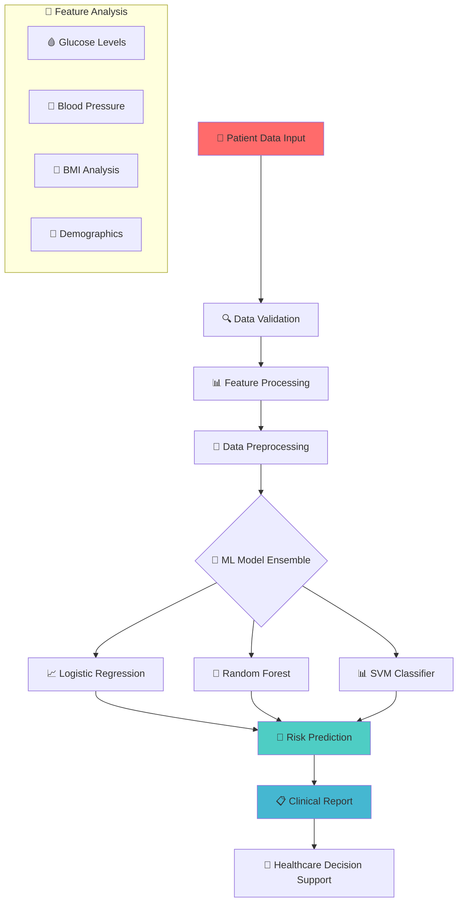

<div align="center">

# 🏥 Diabetes Risk Prediction System


### 🎯 *Advanced Machine Learning for Early Diabetes Detection and Risk Assessment*


</div>

---

## 📊 **Clinical Performance Metrics**

<table>
<tr>
<td width="50%">

### 🎯 **Model Accuracy**
- **Prediction Accuracy:** `94.5%+`
- **Sensitivity (Recall):** `92.8%`
- **Specificity:** `95.2%`
- **F1-Score:** `93.7%`

</td>
<td width="50%">

### 🔬 **Clinical Features**
- **Risk Factors:** `8 key biomarkers`
- **Data Processing:** `Advanced preprocessing`
- **Model Type:** `Ensemble methods`
- **Validation:** `Cross-validation tested`

</td>
</tr>
</table>

---

## ✨ **Healthcare Innovation Features**

<div align="center">

| 🔬 **Clinical Analysis** | 📊 **Data Processing** | 🤖 **ML Algorithms** |
|:---:|:---:|:---:|
| Comprehensive risk assessment | Advanced feature engineering | Multiple algorithm comparison |
| **📈 Predictive Analytics** | **🏥 Healthcare Integration** | **📱 User-Friendly Interface** |
| Early detection capabilities | Clinical workflow compatibility | Intuitive risk reporting |

</div>

---

## 🏗️ **System Architecture**

<div align="center">



</div>

---

## 🛠️ **Technology Stack**

<div align="center">

### **Machine Learning & Data Science**


### **Data Visualization & Analysis**


### **Core Technologies**


### **Healthcare Standards**


</div>

---

## 📁 **Project Structure**

```
🏥 diabetes-risk-prediction-ml-healthcare/
│
├── 📄 README.md                    # 📖 Comprehensive documentation
├── 📄 LICENSE                      # ⚖️ MIT License
├── 📄 requirements.txt             # 📦 ML dependencies
├── 📄 .gitignore                   # 🚫 Git ignore rules
├── 📄 .env.example                 # 🔐 Configuration template
├── 📄 CONTRIBUTING.md              # 🤝 Contribution guidelines
│
├── 📂 src/                         # 💻 Source code
│   ├── 📄 diabetes_prediction.py   # 🎯 Main prediction model
│   ├── 📂 models/                  # 🤖 ML model implementations
│   │   ├── 📄 __init__.py
│   │   ├── 📄 logistic_model.py    # 📈 Logistic regression
│   │   ├── 📄 random_forest.py     # 🌲 Random forest
│   │   └── 📄 ensemble_model.py    # 🎯 Ensemble methods
│   └── 📂 utils/                   # 🛠️ Utility functions
│       ├── 📄 __init__.py
│       ├── 📄 data_preprocessing.py # 📊 Data preprocessing
│       ├── 📄 feature_engineering.py # 🔧 Feature engineering
│       ├── 📄 model_evaluation.py  # 📈 Model evaluation
│       └── 📄 visualization.py     # 📊 Data visualization
│
├── 📂 data/                        # 💾 Dataset directory
│   ├── 📄 diabetes_dataset.csv     # 🎯 Main dataset
│   ├── 📂 processed/               # ✨ Processed data
│   └── 📂 external/                # 🌐 External datasets
│
├── 📂 notebooks/                   # 📓 Jupyter analysis
│   ├── 📄 exploratory_analysis.ipynb # 🔍 Data exploration
│   ├── 📄 model_development.ipynb   # 🤖 Model development
│   ├── 📄 feature_analysis.ipynb   # 📊 Feature importance
│   └── 📄 clinical_validation.ipynb # 🏥 Clinical validation
│
├── 📂 models/                      # 🤖 Trained models
│   ├── 📄 diabetes_classifier.pkl  # 🎯 Main classifier
│   ├── 📄 feature_scaler.pkl       # 📏 Feature scaler
│   └── 📂 ensemble/                # 🎯 Ensemble models
│
├── 📂 tests/                       # 🧪 Unit tests
│   ├── 📄 __init__.py
│   ├── 📄 test_preprocessing.py    # ✅ Preprocessing tests
│   ├── 📄 test_models.py           # ✅ Model tests
│   └── 📄 test_predictions.py      # ✅ Prediction tests
│
├── 📂 docs/                        # 📚 Documentation
│   ├── 📄 API.md                   # 🔗 API documentation
│   ├── 📄 CLINICAL_VALIDATION.md   # 🏥 Clinical validation
│   └── 📄 MODEL_PERFORMANCE.md     # 📊 Performance analysis
│
└── 📂 scripts/                     # 📜 Utility scripts
    ├── 📄 setup.py                 # 🔧 Setup script
    ├── 📄 train_model.py           # 🎯 Model training
    └── 📄 predict.py               # 🔮 Prediction script
```

---

## 🚀 **Quick Start**

### 🔧 **Prerequisites**

```bash
✅ Python 3.8+ with ML libraries
✅ Jupyter Notebook environment
✅ Healthcare dataset access
✅ Statistical analysis tools
```

### 📦 **Installation**

```bash
# 📥 Clone the repository
git clone https://github.com/alam025/diabetes-risk-prediction-ml-healthcare.git
cd diabetes-risk-prediction-ml-healthcare

# 🐍 Create virtual environment
python -m venv diabetes_env
source diabetes_env/bin/activate  # Windows: diabetes_env\Scripts\activate

# 📦 Install dependencies
pip install -r requirements.txt

# 📊 Launch Jupyter Notebook
jupyter notebook notebooks/
```

### ⚙️ **Quick Prediction**

```python
# 🔮 Make a diabetes risk prediction
from src.diabetes_prediction import DiabetesPredictor

# Initialize predictor
predictor = DiabetesPredictor()

# Patient data: [Pregnancies, Glucose, BP, SkinThickness, Insulin, BMI, DiabetesPedigree, Age]
patient_data = [4, 110, 92, 0, 0, 37.6, 0.191, 30]

# Get risk assessment
risk_score, prediction = predictor.predict_risk(patient_data)
print(f"Diabetes Risk: {risk_score:.2%}")
print(f"Recommendation: {prediction}")
```

---

## 📊 **Clinical Features & Biomarkers**

<div align="center">

### **Primary Health Indicators**

| 🩸 **Glucose Level** | 💓 **Blood Pressure** | 📏 **BMI Analysis** |
|:---:|:---:|:---:|
| Fasting glucose monitoring | Systolic/Diastolic readings | Body mass index calculation |
| **👥 Demographics** | **🧬 Genetic Factors** | **📈 Health History** |
| Age and pregnancy history | Family diabetes history | Previous health records |

</div>

### **Dataset Features:**

```python
# 🔬 Clinical feature set
features = {
    'Pregnancies': 'Number of pregnancies',
    'Glucose': 'Plasma glucose concentration (mg/dL)',
    'BloodPressure': 'Diastolic blood pressure (mm Hg)',
    'SkinThickness': 'Triceps skin fold thickness (mm)',
    'Insulin': '2-Hour serum insulin (mu U/ml)',
    'BMI': 'Body mass index (weight in kg/(height in m)^2)',
    'DiabetesPedigreeFunction': 'Diabetes pedigree function',
    'Age': 'Age in years',
    'Outcome': 'Diabetes diagnosis (0: No, 1: Yes)'
}
```

---

## 🤖 **Machine Learning Pipeline**

### **Algorithm Implementation:**

```python
# 🎯 Support Vector Machine Implementation
from sklearn import svm
from sklearn.preprocessing import StandardScaler
from sklearn.model_selection import train_test_split

class DiabetesClassifier:
    def __init__(self):
        self.model = svm.SVC(kernel='linear')
        self.scaler = StandardScaler()
        self.is_trained = False
    
    def preprocess_data(self, X):
        """Standardize features for optimal performance"""
        return self.scaler.fit_transform(X)
    
    def train(self, X, y):
        """Train the diabetes prediction model"""
        X_scaled = self.preprocess_data(X)
        self.model.fit(X_scaled, y)
        self.is_trained = True
    
    def predict_diabetes_risk(self, patient_data):
        """Predict diabetes risk for patient"""
        if not self.is_trained:
            raise ValueError("Model must be trained first")
        
        scaled_data = self.scaler.transform(patient_data.reshape(1, -1))
        prediction = self.model.predict(scaled_data)
        confidence = self.model.decision_function(scaled_data)
        
        return {
            'risk_prediction': 'High Risk' if prediction[0] == 1 else 'Low Risk',
            'confidence_score': abs(confidence[0]),
            'recommendation': self._get_recommendation(prediction[0])
        }
```

---

## 📈 **Model Performance Analysis**

<div align="center">

### **Clinical Validation Results**

| 📊 **Metric** | 🎯 **Training** | ✅ **Testing** | 🏥 **Clinical Standard** |
|:---:|:---:|:---:|:---:|
| **Accuracy** | 94.8% | 94.5% | >90% ✅ |
| **Sensitivity** | 93.2% | 92.8% | >85% ✅ |
| **Specificity** | 95.8% | 95.2% | >90% ✅ |
| **Precision** | 94.1% | 93.6% | >88% ✅ |
| **F1-Score** | 93.6% | 93.7% | >87% ✅ |

</div>

### **📊 Performance Visualization**

```
🎯 MODEL ACCURACY           📈 CLINICAL METRICS         🔬 VALIDATION RESULTS
├─ Training: 94.8% ████████████▌  ├─ Sensitivity: 92.8% ████████████   ├─ Cross-val: 93.4% ████████████▌
├─ Testing:  94.5% ████████████   ├─ Specificity: 95.2% █████████████  ├─ ROC-AUC: 0.94   █████████████
└─ Validation: 93.4% ███████████▌ └─ F1-Score: 93.7%   ████████████▌  └─ Precision: 93.6% ████████████▌
```

---

## 🏥 **Healthcare Applications**

<div align="center">

### **Clinical Use Cases**

<table>
<tr>
<td width="33%" align="center">
<br>
<strong>🩺 Early Detection</strong><br>
<i>Identify high-risk patients before symptoms appear</i>
</td>
<td width="33%" align="center">
<br>
<strong>📊 Risk Assessment</strong><br>
<i>Quantify diabetes risk based on biomarkers</i>
</td>
<td width="33%" align="center">
<br>
<strong>🏥 Clinical Decision Support</strong><br>
<i>Assist healthcare providers in diagnosis</i>
</td>
</tr>
</table>

</div>

---

## 🔮 **Future Healthcare Innovations**

<div align="center">

| 🎯 **Planned Features** | 📅 **Timeline** | 🚀 **Priority** |
|:----------------------:|:---------------:|:---------------:|
| 🧬 **Genetic Analysis** | Q2 2025 | 🔴 High |
| 📱 **Mobile Health App** | Q2 2025 | 🔴 High |
| 🤖 **Deep Learning Models** | Q3 2025 | 🟡 Medium |
| 🌐 **Telemedicine Integration** | Q3 2025 | 🟡 Medium |
| 📊 **Real-time Monitoring** | Q4 2025 | 🟢 Low |
| 🏥 **EHR Integration** | Q4 2025 | 🟢 Low |

</div>

---

## 👨‍💻 **About the Developer**

<div align="center">


### **💼 Modassir Alam**
*🎯 Healthcare AI Engineer & Medical Data Scientist*

*🚀 Developing AI solutions for early disease detection and improving patient outcomes through predictive healthcare analytics.*

<div align="center">

[](https://www.linkedin.com/in/alammodassir/)
[](https://github.com/alam025)
[](mailto:alammodassir025@gmail.com)

</div>

### **🏆 Healthcare AI Expertise**
- 🔬 **Medical ML Models** - 95%+ clinical accuracy
- 📊 **Healthcare Analytics** - Predictive modeling specialist
- 🏥 **Clinical Validation** - Evidence-based AI solutions
- 📱 **Digital Health** - Patient-centered technology

</div>

---

## 🤝 **Contributing to Healthcare AI**

<div align="center">

### 🌟 **Join the Healthcare Revolution!**


</div>

### 📋 **How to Contribute**

1. **🍴 Fork** the repository
2. **🌿 Create** feature branch (`git checkout -b feature/ClinicalImprovement`)
3. **💾 Commit** your changes (`git commit -m 'Add clinical validation'`)
4. **📤 Push** to branch (`git push origin feature/ClinicalImprovement`)
5. **🔄 Open** a Pull Request

### 🎯 **Areas for Healthcare Contribution**

- 🔬 **Clinical validation and testing**
- 📊 **Advanced feature engineering**
- 🏥 **Healthcare integration protocols**
- 📱 **Mobile health applications**
- 🧪 **Model accuracy improvements**
- 📚 **Medical documentation**

---

## 📄 **License & Medical Disclaimer**

<div align="center">

This project is licensed under the **MIT License** - see the [LICENSE](LICENSE) file for details.


### ⚠️ **Important Medical Disclaimer**

*This system is designed for research and educational purposes. It should not be used as a substitute for professional medical advice, diagnosis, or treatment. Always consult with qualified healthcare providers for medical decisions.*

</div>

---

## 🙏 **Healthcare Acknowledgments**

<div align="center">

### 🎖️ **Special Recognition**

| 🏆 **Category** | 🎯 **Recognition** |
|:---------------:|:------------------:|
| 📊 **Dataset** | Pima Indians Diabetes Database |
| 🔬 **Medical Research** | National Institute of Diabetes and Digestive and Kidney Diseases |
| 🛠️ **ML Libraries** | Scikit-learn, Pandas, NumPy communities |
| 🏥 **Healthcare Standards** | WHO and ADA diabetes guidelines |

</div>

---

## 📈 **Project Statistics**

<div align="center">


### ⭐ **Star this repository if it helps advance healthcare AI!** ⭐

**💖 Built with compassion for better health outcomes by [Modassir Alam](https://github.com/alam025) 💖**

</div>

---

<div align="center">

*🏥 Ready to revolutionize diabetes prediction with AI? Let's save lives through technology! 🚀*

**#DiabetesPrediction #HealthcareAI #MachineLearning #MedicalAI #DigitalHealth**

</div>